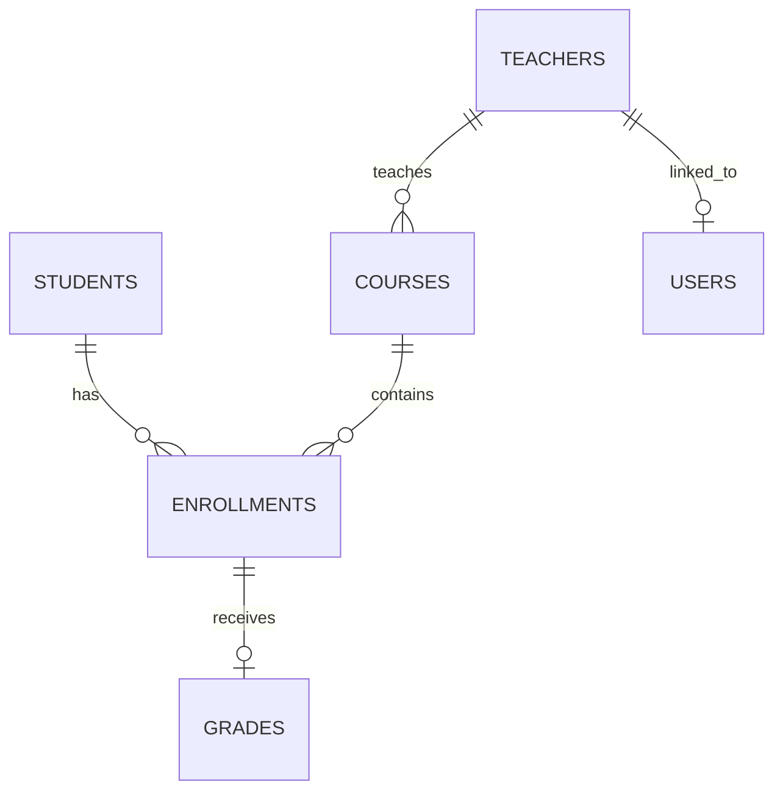

# Student Management System

## Overview

A desktop student administration system built with Python, PyQt6 and MySQL. It manages students, teachers, courses, enrollments, grades and authenticated users through a layered architecture designed to keep UI code separate from database access.

## Features

- Admin CRUD for students, teachers and courses
- Admin enrollment and grade management with duplicate-enrollment prevention
- Student profiles with course history and average grade
- Course analytics with enrollment and grade statistics
- Admin and teacher role-based access control enforced in services
- Teacher-scoped course/student views and grade entry for assigned courses only
- User creation and account activation/deactivation for administrators
- Database-driven dashboard with totals, course summaries, recent enrollments and grade distribution
- Search/filtering for students, teachers and courses
- Central validation, parameterized SQL, bcrypt password hashing and application logging
- Optional FastAPI REST API (`api.py`) exposing the same service layer over HTTP with JWT authentication
- Docker Compose setup for a one-command MySQL development database
- CI (GitHub Actions): unit tests on every push plus integration tests against a real MySQL 8.0 service container

## Architecture

```text
PyQt6 UI
   ↓
Services / Business Rules
   ↓
Repositories / DAO
   ↓
MySQL
```

UI classes render forms/tables and trigger service calls. Services own validation, authorization and workflow rules. Repositories own SQL and database persistence. `db.py` owns connection configuration.

## Database Design

Core tables:

- `students`
- `teachers`
- `courses`
- `enrollments`
- `grades`
- `users`

`enrollments` resolves the many-to-many relationship between students and courses. `grades.enrollment_id` is unique, so an enrollment has at most one current grade. Foreign keys enforce referential integrity; deleting a student or course cascades dependent enrollments and grades, while deleting a teacher leaves courses unassigned.



## Authentication and Authorization

Passwords are stored only as bcrypt hashes. Login rejects unknown or inactive accounts without revealing which credential failed.

`ADMIN` can manage all application data and users. `TEACHER` accounts are linked to one teacher profile, can view assigned courses/students, and can create or update grades only for their own courses. Authorization is enforced in service methods rather than relying on hidden/disabled UI controls.

## Security

- Password hashing with bcrypt
- Environment-based database credentials
- Parameterized SQL for user-controlled values
- Central business validation
- Service-level authorization checks
- Human-readable UI errors with technical failures logged separately
- No password, password hash or secret logging

## Installation

### 1. Create a virtual environment

```powershell
python -m venv .venv
.venv\Scripts\activate
python -m pip install -r requirements.txt
```

### 2. Configure the database

Copy the example environment file:

```powershell
Copy-Item .env.example .env
```

Set:

```text
DB_HOST=localhost
DB_PORT=3306
DB_USER=root
DB_PASSWORD=your_mysql_password
DB_NAME=student_management
```

#### Option A — use your own MySQL server

```powershell
mysql -u root -p < database/schema.sql
mysql -u root -p student_management < database/seed_data.sql
```

#### Option B — Docker Compose (recommended)

Starts a MySQL 8.0 container on host port **3307** with schema and seed data applied automatically:

```powershell
docker compose up -d
```

Then set in `.env`: `DB_PORT=3307` and `DB_PASSWORD=sms_dev_password` (the container's dev-only root password). The `docker-init/` folder is regenerated from `database/schema.sql` — see the comment inside it.

### 3. Create the first user

Create the first user without storing its password in source code:

```powershell
python scripts/create_user.py
```

For a teacher account, use the corresponding fictional teacher ID from the seed data.

### Existing installation

Back up the database first, then run `database/migrations/001_auth_and_identifiers.sql` once against the existing `student_management` database. The migration adds the identifier and authentication structures introduced by the upgraded schema; it is intentionally a one-time upgrade rather than a migration framework.

## Running the application

```powershell
python main.py
```

## Running the REST API (optional)

Install the API-only dependencies, set a JWT secret in `.env`, and start the server:

```powershell
python -m pip install -r requirements-api.txt
python -c "import secrets; print(f'API_JWT_SECRET={secrets.token_urlsafe(48)}')"   # paste into .env
uvicorn api:app --reload
```

Interactive docs open at <http://127.0.0.1:8000/docs>. The API wraps the same service layer as the desktop UI, so every authorization and validation rule applies identically to HTTP clients. `tests/test_api.py` covers login, token handling and error-code mapping without needing a database.

## Running tests

```powershell
python -m pytest -q
python -m compileall -q .
```

Unit tests (validation, authentication, authorization, service delegation, API mapping, repository transaction behavior) run without a database. Integration tests (`tests/test_integration.py`) run against a real MySQL configured with `TEST_DB_*` variables and **skip automatically when no server is reachable**; they only ever create/drop the dedicated `student_management_test` database. CI runs both suites, using a MySQL 8.0 service container for the integration job.

See `DESIGN.md` for the reasoning behind the database design, indexes, transactions and layering — useful preparation for defending the project in an interview.

## SQL Portfolio

`database/queries.sql` contains meaningful examples covering:

- basic joins and multi-table joins
- `LEFT JOIN`
- `GROUP BY` / `HAVING`
- aggregates
- subqueries and correlated subqueries
- `CASE`
- `EXISTS` / `NOT EXISTS`
- `RANK()` and window functions
- running totals
- reusable reporting views
- exact identifier lookups and indexing considerations

## Project Structure

```text
student-management-system/
├── main.py
├── api.py                  # FastAPI layer over the same services
├── config.py
├── db.py
├── validation.py
├── repositories.py
├── services.py
├── dialogs.py
├── tabs.py
├── resources/app.qss
├── docker-compose.yml
├── docker-init/            # auto-applied schema + seed for the container
├── .github/workflows/ci.yml
├── database/
│   ├── schema.sql
│   ├── seed_data.sql
│   ├── queries.sql
│   └── migrations/
├── scripts/
│   ├── create_user.py
│   └── create_docker_user.py
├── tests/                  # unit + API + integration suites
├── DESIGN.md
├── .env.example
├── .gitignore
├── requirements.txt
└── requirements-api.txt
```

## Future Improvements

A natural next step would be pagination and rate limiting for the REST API, an audit history for administrative changes, and automated GUI testing.
